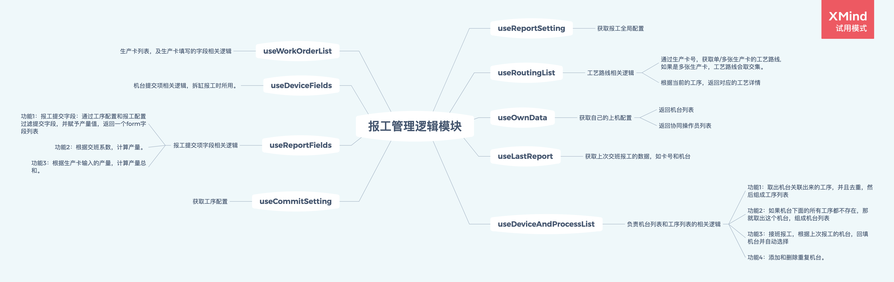
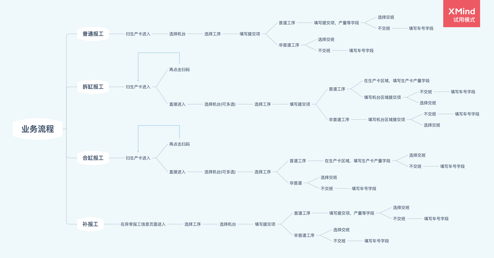

## 依赖相关
页面地址：`http://192.168.2.153:2030/productionOperation/productionOperation/basicDataMaintenance/operatorProcessConfiguration`

代码库：
- pc: `git@123.59.26.169:fe/production_operation.git`
- app: `git@123.59.26.169:fe/app_demo_pre.git` 
	- 文件位置：`src/pages/productionOperation`

原型：
`https://lanhuapp.com/web/#/item/project/product?pid=b5c211ed-6dee-49d0-86c4-ec06ad32bc9d&versionId=a83dee06-a43e-4ac8-b6f0-a3709beec4ff&docId=9c34d8d1-8286-4004-9afd-c8dbfeca5194&docType=axure&pageId=2fcd5faf6cd24444829f5dd0122430e1&image_id=9c34d8d1-8286-4004-9afd-c8dbfeca5194`

报工feature地址:`http://wiki.binmade.cn/pages/viewpage.action?pageId=33100302`

测试用例：`http://wiki.binmade.cn/pages/viewpage.action?pageId=25461521`

产品：暂定曹贝

测试：陈晶锐

业务上不懂的地方，可以问他们两个

## 业务相关

### 业务介绍
为了将坯布加工为成品，需要进行一系列工序处理，这些工序就组成了一个工艺路线。报工管理就是在这个过程中，每完成一个工序就进行一次汇报。这样就能对生产过程进行一个实时监控，并且获得产量的统计，再从产量中计算工人的工资。

### 操作流程
主流程：
-  给工人配置他所负责的工序
	-  页面：操作员工序配置
	-  配置他的负责工序，（这个工序能关联出机台，然后在上机配置就只能选择这些关联出的机台）
- 配置工序
	- 页面：工序报工配置
	- 可以配置那个工序的规则和限制
- 配置计件工资规则
	- 页面：计件规则配置
	- 并设置涵盖岗位，工人报工的后会自动根据自己的岗位匹配上工资的规则。
- 进行上机配置
	- 页面：app上机配置
	- 配置当天自己所要操作的机台，机台会关联出工序。
- 扫码报工
	- 页面：扫码报工
	- 对一张生产卡进行扫码报工，选择机台和工序，如果是首道工序需要填写产量，不然会自动计算产量。然后点击报工。

### 通用概念
- 首道报工：工艺路线中第一个报工的工序，在那时输入的产量会继承到之后所有报工的工序。
- 工序选择/机台选择，目前一般都用机台选择，工序选择模式很久没有经过测试，如果开启这个功能需要多加注意。
	- 工序选择：
		- 上机配置时需要选择机台和工序
		- 报工时只能报那个工序，机台则可选
	- 机台选择：
		- 上机配置时需要选择机台，无需选择工序。
		- 报工时，先选机台，根据机台会关联出一个工序列表，然后再选择工序进行报工。
- 单缸报工/普通报工：只能选择一个机台和一张生产卡
- 合缸报工：可以选择单/多个机台和多个生产卡
- 拆缸报工：可以选择单/多个机台和单/多个生产卡
- 交班报工：
	- 场景：一个人做到一半，可以先进行交班报工(选择自己完成的系数，也就是进度)，然后交给另一个人，那个人做完后再进行接班报工(和交班报工同一个入口，不用选系数，会自动计算)，就完成了一个工序。
	- 每个工序只能交接班一次，除了拆缸重复机台的场景。
- 岗位/计件规则：
	- 在PC端计件规则配置页面中可配置工资计算规则，其中有涵盖岗位这一项，工人报工时会根据他的岗位去匹配规则
	- 但是在上机配置中，也可以开启自选计件规则，也可称之为选择岗位(现实场景中都这么叫)。

### 部分页面
PC：

#### 操作员工序配置
编辑操作员的辅助工序，这个工序能关联出机台，然后在上机配置就只能选择这些关联出的机台

数据源
- 操作员：人员

#### 工序报工配置
可以配置工序的规则和限制

- 是否需要添加操作员一同报工： 开启则允许在上机配置时选择协同操作员
- 是否选择岗位：在操作员也开启的情况下，就允许在上机配置时对给协同操作员选择岗位。
- 是否显示计件工资：开启则会在APP个人产量显示每道工序的工资。
- 是否有实际匹数： 若开启，在报工时需要填写实际匹数字段
- 是否有合缸：允许进行合缸报工
- 是否有拆缸： 允许进行拆缸报工
- 统计指标是否显示
	- 是否在报工配置中显示：开启则在报工时需要填写对应字段
	- 是否在产量统计中显示：开启则在APP产量显示中显示对应字段
- 是否有机缸附加项
	- 开启并配置，就能在报工页面选择机缸附加项（非必选）
- 是否有交班：开启则允许交班报工
- 首道交班
	- 明确产量
		- 首道报工，交班时输入总产量，再选择交班系数，如“进好布”(系数为0.3)，那么本次产量 = 输入产量 * 0.3。交班时自动计算剩余产量，为交班时输入产量 * 0.7
	- 不明确产量：首道报工时，交接班都能输入产量，最终生产卡的产量由这两次报工总和而成。

提交项：
可以配置在报工时自定义的提交项
- 是否产量显示：是否显示在APP个人产量中

#### 报工综合配置
配置全局的一个报工规则

- 上机配置选择
	- 机台选择：上机配置时需要选择机台，报工时，先选机台，根据机台会关联出一个工序列表，然后再选择工序进行报工。
	- 工序选择：上机配置时需要选择机台和工序，报工时只能报那个工序，机台则可选。
- 产量单位：选择米/千克，在报工时就只能输入米/千克，并且所有页面的列表显示项都只会显示米/千克
- 克重中间值：如150，那么低于150的就是薄布，高于150的就是厚布，在个人产量的列表的那一项会有具体显示。
- 报工允许输入产量的偏差范围：
	- 例：偏差范围是10%，一张生产卡，如果是1000米数，报工时如果输入低于900以及高于1100时都会进行错误提醒，但仍然允许提交。
- 月产量时间范围
	- 自定义时间：如设置3日，那么这个月的产量就是从当月3日到下月3日。
	- 自然月：就是1日
- 日产量时间范围
	- 自定义时间：如设置8:00，那么当天的产量就是从当天8点到明日8点。
	- 自然日：就是00:00点
- 报工键盘：配置报工时的键盘显示

## 代码相关
核心页面的注释文档已经写在代码中了，具体到细节的地方可以在代码上看。这里主要讲大致流程。

不需要懂得所有代码细节，只要懂得哪个逻辑模块负责哪个功能就行，到了debug和开发新功能时，再到相应的模块去处理。

### 扫码界面
该页面是\[扫码报工、合缸报工、拆缸报工、修改工序\]这几个页面的扫码界面，扫码成功后，会跳转到各自的页面

主要通过`useCodeListFromStorage`这个组件去管理扫到的生产卡号。

手动输入生产卡时，会弹出一个自定义键盘，这个键盘是在报工综合配置去进行管理的。

### 报工

#### 逻辑模块

思路是按照数据源或功能拆分成为一个个`custom hooks`，debug或拓展功能时需要到对应的模块去编写逻辑。

| 通用                    | 普通报工        | 拆缸报工        | 合缸报工        |
| ----------------------- | --------------- | --------------- | --------------- |
| useReportSetting        | useReportFields | useReportFields | useReportFields |
| useRoutingList          |                 | useDeviceFields |                 |
| useOwnData              |                 |                 |                 |
| useLastReport           |                 |                 |                 |
| useDeviceAndProcessList |                 |                 |                 |
| useWorkOrderList        |                 |                 |                 |
| useCommitSetting        |                 |                 |                 |

#### 业务流程

#### 特殊逻辑
- 产量翻倍
	- 在pc端特殊产量配置页面，可配置翻倍工序和翻倍规则，（只有单缸报工会触发）
	- 前置条件工序：在工艺路线中，当前工序之前，如果匹配上这些前置工序，那么就触发产量翻倍。
	- 规则失效工序：在工艺路线中，当前工序之前，如果匹配上这些失效工序，那么就不触发产量翻倍，不论是否有前置
- 拆缸重复机台
	- 选择机台时，可点击旁边的+号，这样会拷贝出一同样的机台，并且相同机台之间会打上一个tag序号作为区分。每个机台，都可以自由的进行交接班报工，但是总体产量必须要与生产卡总量相同

#### 自定义键盘
自定义键盘一般情况下无需维护，了解即可

采用三个组件来实现

- CustomScrollView
  - 作为包裹自定义输入框与自定义键盘的一个容器
  - 具体原理是在点击输入框时，自动在最底部创建一个与键盘等高的盒子，这样就能在弹出键盘时顶起视图。
- CustomInput
  - 手动实现的一个输入框
  - 是为了获取到当前的节点的相对容器高度和绝对高度，以便scrollView滚动
- CustomKeyboard
	- 键盘
	- 可根据传入的数组来渲染出键盘

todo: 后续如果要迭代的话，可用android原生来重新实现一个，比RN实现更好。